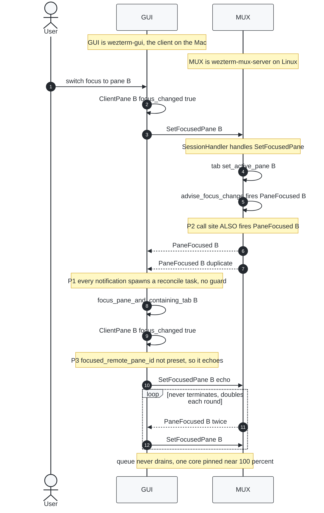
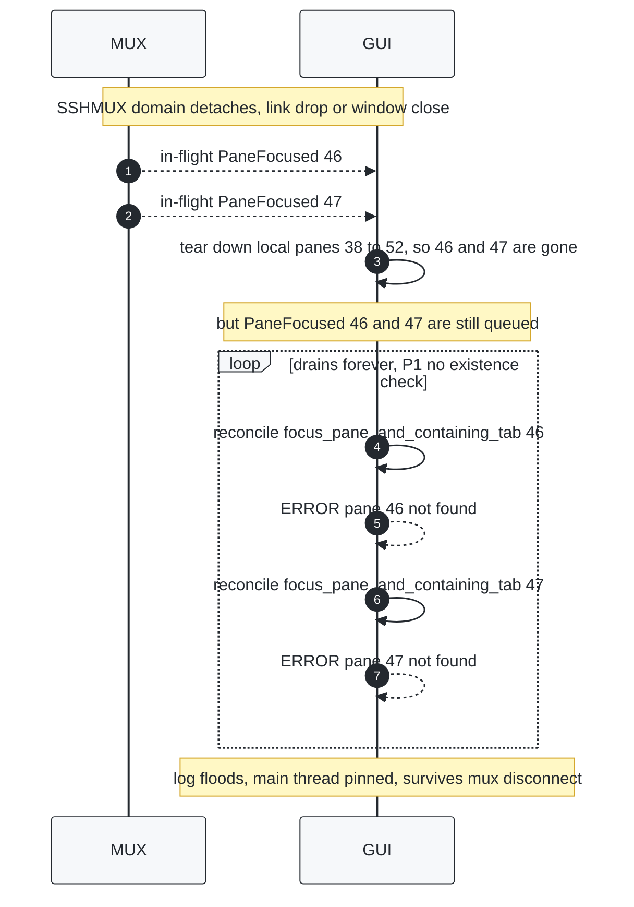
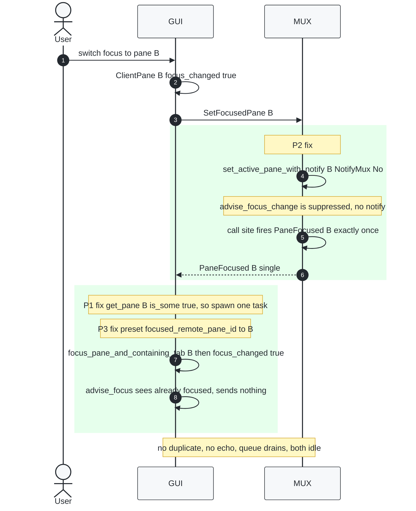
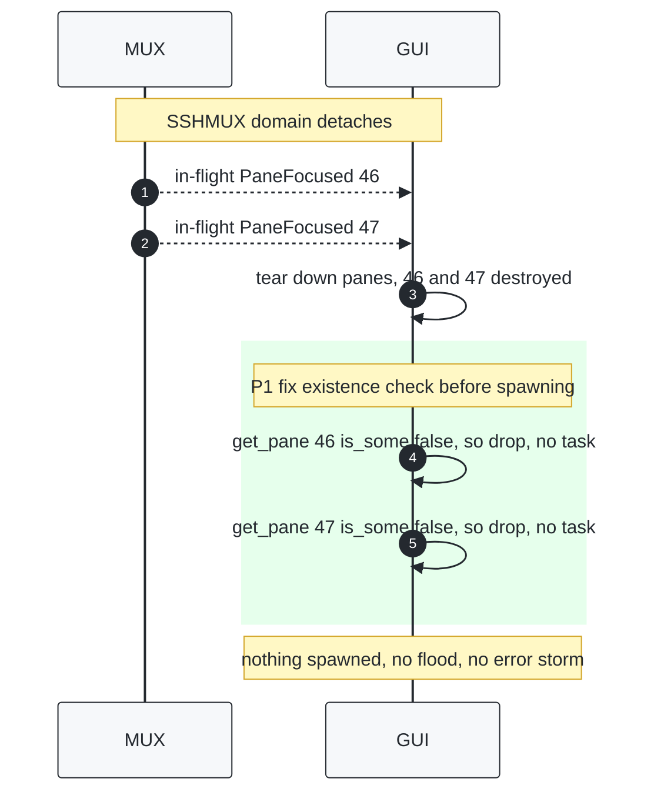

# PaneFocused storm — event/notification flow across the client↔server boundary

Sequence diagrams of the focus-notification protocol between the **client**
(`wezterm-gui`, on the Mac) and the **server** (`wezterm-mux-server`, on Linux),
over the SSHMUX connection — before and after PR #7763.

Two PDUs cross the boundary:

- **`SetFocusedPane(id)`** — client → server: "the user focused this pane here."
  Sent by `ClientPane::advise_focus` (`wezterm-client/src/pane/clientpane.rs:579`),
  **only if** `focused_remote_pane_id != id`.
- **`PaneFocused(id)`** — server → client: a `MuxNotification` broadcast, converted to a
  PDU in `wezterm-mux-server-impl/src/dispatch.rs:169`. The client's frontend reacts by
  spawning a main-thread reconcile task (`wezterm-gui/src/frontend.rs`).

The three compounding bugs (and their fixes):

| | Bug | Where | Fix in PR #7763 |
|---|---|---|---|
| **P1** | A `PaneFocused` for a destroyed pane still spawns a doomed reconcile task, giving the `pane N not found` flood | `frontend.rs` | guard `Mux::get().get_pane(id).is_some()` before spawning |
| **P2** | Every focus change emits `PaneFocused` **twice** — once in `advise_focus_change`, once at the call site | `mux/src/tab.rs`, `sessionhandler.rs`, `tmux_commands.rs`, `mux/src/lib.rs` | `NotifyMux::No` suppresses the `advise_focus_change` copy |
| **P3** | Receiving a server `PaneFocused` makes the client `focus_changed`, which echoes `SetFocusedPane` back | `clientpane.rs` | pre-set `focused_remote_pane_id` so `advise_focus` sees it's already focused and skips the echo |

P1 produces the *log flood / wasted UI-thread tasks*. **P2 + P3 are what make the loop
self-sustaining** — the doubling feeds the queue and the echo regenerates the input.

---

## BEFORE — steady-state loop (a single focus change never settles)

`P2` (server doubles every notify) plus `P3` (client echoes every notify back) form a
closed feedback loop with 2x amplification per round. One user action seeds it, then it
runs on its own with no further input until a core is pinned.

## BEFORE — domain-detach storm (the `pane N not found` flood)

When the domain detaches, the client tears down its local panes, but `PaneFocused`
notifications for those now-destroyed ids are already queued. With no existence check
(P1), each spawns a doomed reconcile task.

---

## AFTER — clean focus change (loop broken at both ends)

## AFTER — domain detach (stale notifications dropped)

---

## Why each fix alone is insufficient

- **P1 only** (guard) stops the `pane N not found` flood and saves UI-thread tasks, but the
  doubling plus echo still loop over *live* panes, so the focus still ping-pongs.
- **P2 only** (no double) halves the traffic, but the echo still sustains a 1x loop.
- **P3 only** (no echo) stops the client re-injecting, but a detach burst of stale
  notifications still floods the UI thread.

All three together: one focus change produces exactly one notification, reconciled once,
with no echo and no stale-pane work — the loop cannot form.
