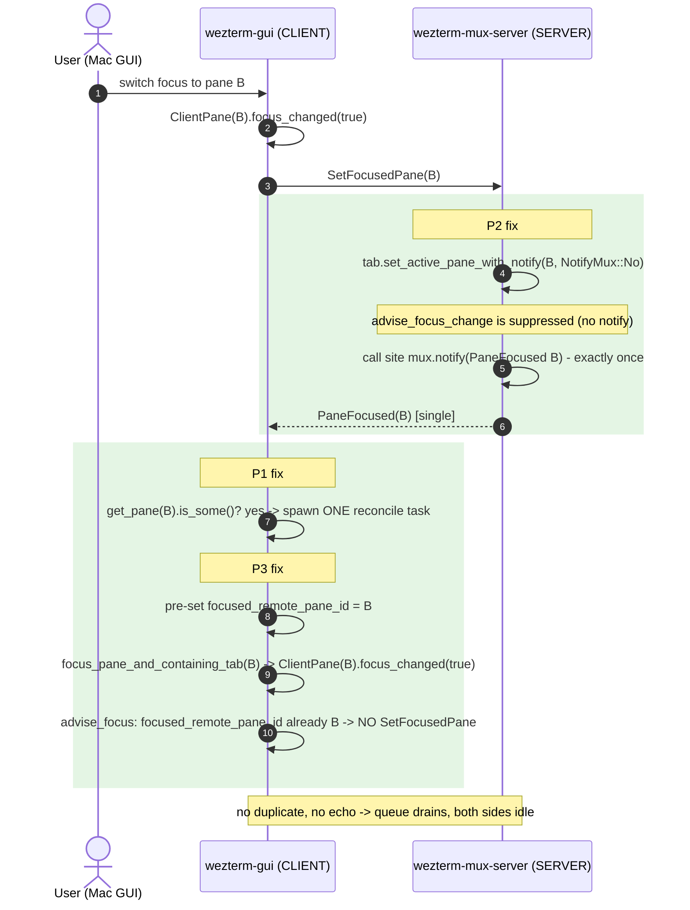

# PaneFocused storm — event/notification flow across the client↔server boundary

Sequence diagrams of the focus-notification protocol between the **client**
(`wezterm-gui`, on the Mac) and the **server** (`wezterm-mux-server`, on Linux),
over the SSHMUX connection — before and after PR #7763.

Two PDUs cross the boundary:

- **`SetFocusedPane(id)`** — client → server: "the user focused this pane here."
  Sent by `ClientPane::advise_focus` (`wezterm-client/src/pane/clientpane.rs:579`),
  **only if** `focused_remote_pane_id != id`.
- **`PaneFocused(id)`** — server → client: a `MuxNotification` broadcast, converted to a
  PDU in `wezterm-mux-server-impl/src/dispatch.rs:169`. The client's frontend reacts by
  spawning a main-thread reconcile task (`wezterm-gui/src/frontend.rs`).

The three compounding bugs (and their fixes):

| | Bug | Where | Fix in PR #7763 |
|---|---|---|---|
| **P1** | A `PaneFocused` for a destroyed pane still spawns a doomed reconcile task → `pane N not found` flood | `frontend.rs` | guard `Mux::get().get_pane(id).is_some()` before spawning |
| **P2** | Every focus change emits `PaneFocused` **twice** (once in `advise_focus_change`, once at the call site) | `mux/src/tab.rs`, `sessionhandler.rs`, `tmux_commands.rs`, `mux/src/lib.rs` | `NotifyMux::No` suppresses the `advise_focus_change` copy |
| **P3** | Receiving a server `PaneFocused` makes the client `focus_changed` → echoes `SetFocusedPane` back | `clientpane.rs` | pre-set `focused_remote_pane_id` so `advise_focus` sees it's already focused and skips the echo |

P1 produces the *log flood / wasted UI-thread tasks*; **P2 + P3 are what make the loop
self-sustaining** — the doubling feeds the queue and the echo regenerates the input.

---

## BEFORE — steady-state loop (a single focus change never settles)

`P2` (server doubles every notify) + `P3` (client echoes every notify back) form a closed
feedback loop with **2× amplification per round**. One user action seeds it; it then runs
on its own with no further input until a core is pinned.

```mermaid
sequenceDiagram
    autonumber
    actor U as User (Mac GUI)
    participant G as wezterm-gui (CLIENT)
    participant S as wezterm-mux-server (SERVER)

    U->>G: switch focus to pane B
    G->>G: ClientPane(B).focus_changed(true)
    G->>G: advise_focus: focused_remote_pane_id (A to B) differs
    G->>S: SetFocusedPane(B)

    Note over S: SessionHandler handles SetFocusedPane
    S->>S: tab.set_active_pane(B)
    S->>S: advise_focus_change -> mux.notify(PaneFocused B)
    Note over S: P2 - call site ALSO mux.notify(PaneFocused B)
    S-->>G: PaneFocused(B)
    S-->>G: PaneFocused(B) [duplicate]

    Note over G: P1 - each notification spawns a main-thread reconcile task (no guard)
    G->>G: focus_pane_and_containing_tab(B)
    G->>G: ClientPane(B).focus_changed(true)
    Note over G: P3 - focused_remote_pane_id NOT pre-set, B differs
    G->>S: SetFocusedPane(B) [ECHO]

    loop never terminates
        S-->>G: PaneFocused(B) x2
        G->>S: SetFocusedPane(B)
    end
    Note over G,S: reconcile queue never drains; one CPU core pins at ~100%
```

## BEFORE — domain-detach storm (the `pane N not found` flood)

When the domain detaches, the client tears down its local panes, but `PaneFocused`
notifications for those now-destroyed ids are already queued. With no existence check (P1),
each spawns a doomed reconcile task.

```mermaid
sequenceDiagram
    autonumber
    participant S as wezterm-mux-server (SERVER)
    participant G as wezterm-gui (CLIENT)

    Note over S,G: SSHMUX domain detaches (link drop / window close)
    S-->>G: in-flight PaneFocused(46)
    S-->>G: in-flight PaneFocused(47)
    G->>G: tear down local panes [38..52] (46, 47 now destroyed)
    Note over G: but PaneFocused(46/47) are still queued

    loop drains forever (P1 - no existence check)
        G->>G: reconcile focus_pane_and_containing_tab(46)
        G-->>G: ERROR "pane 46 not found"
        G->>G: reconcile focus_pane_and_containing_tab(47)
        G-->>G: ERROR "pane 47 not found"
    end
    Note over G: log floods ~262 KB/s; main thread pinned; survives mux disconnect
```

---

## AFTER — clean focus change (loop broken at both ends)



## AFTER — domain detach (stale notifications dropped)

```mermaid
sequenceDiagram
    autonumber
    participant S as wezterm-mux-server (SERVER)
    participant G as wezterm-gui (CLIENT)

    Note over S,G: SSHMUX domain detaches
    S-->>G: in-flight PaneFocused(46)
    S-->>G: in-flight PaneFocused(47)
    G->>G: tear down panes; 46, 47 destroyed
    rect rgb(228,245,228)
    Note over G: P1 fix - existence check before spawning
    G->>G: get_pane(46).is_some()? NO -> DROP (no task)
    G->>G: get_pane(47).is_some()? NO -> DROP (no task)
    end
    Note over G: nothing spawned - no flood, no error storm
```

---

## Why each fix alone is insufficient

- **P1 only** (guard) stops the `pane N not found` flood and saves UI-thread tasks, but the
  **doubling + echo** still loop over *live* panes → the focus still ping-pongs.
- **P2 only** (no double) halves the traffic but the echo still sustains a 1× loop.
- **P3 only** (no echo) stops the client from re-injecting, but a detach burst of stale
  notifications still floods the UI thread.

All three together: one focus change produces exactly one notification, reconciled once,
with no echo and no stale-pane work — the loop cannot form.
